# Slides Guide — What to Put on Each Slide

> One slide per paragraph of the script. Minimal text on slides, the script carries the speech.

---

## Slide 1: Title

**Content:**
- Title: "Integrate the IDM Satellite Engineering Library into the Laboratory Design Process"
- Name: Justine Le Bourg
- UTBM — Shanghai University (dual degree)
- Host: Key Lab for Satellite Digitalisation Technology, IAMCAS, CAS
- Supervisor: Dr. Farid Gamgami
- Date: [defense date]

**Visual:** Logo UTBM + logo IAMCAS side by side. Clean title slide, no diagram.

---

## Slide 2: Outline

**Content:**
- Numbered list, one line each:
  1. Context & Company
  2. Problem & Objectives
  3. Methodology
  4. Technical Achievements
  5. Validation & Limitations
  6. Assessment & Perspectives

**Visual:** Simple numbered list, large font. No diagram.

---

## Slide 3: Context & Company

**Content (bullet points):**
- IAMCAS — 105 satellites launched, 700+ staff, 88% postgrad/PhD
- Key Lab: digital consistency across satellite lifecycle
- APSL team: introducing concurrent engineering in China
- Goal: AI-boosted digital thread for concurrent engineering sessions
- My role: build the reliable computation building block

**Visual — Org chart:**

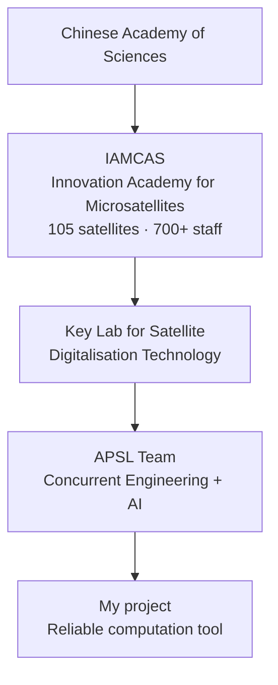

**Tip:** Keep missions (QUESS, DAMPE, SMILE) as small icons or a strip below.

---

## Slide 4: Problem & Objectives

**Content:**
- Research question (centered, larger font):
  > "How to integrate the IDM library into the design process to make preliminary studies faster, more consistent and fully traceable?"

- 4 objectives as a 2x2 grid or numbered list:
  1. Interconnect tools
  2. Automate the chain
  3. Guarantee traceability
  4. Prepare AI integration

**Visual — Objectives diagram:**

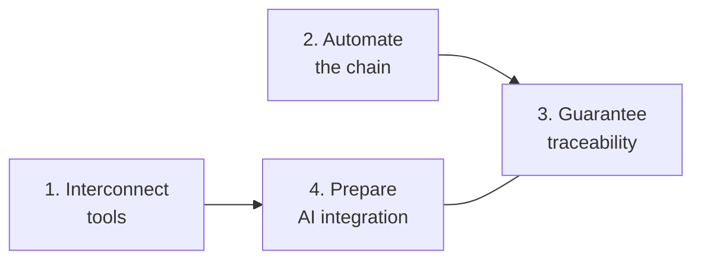

---

## Slide 5: Methodology — 4 Phases

**Content:** Minimal — just the 4 phase names as a timeline.

**Visual — Timeline:**

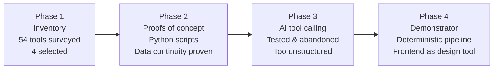

**Tip:** Color Phase 3 in red/orange (pivot/abandonment), Phase 4 in green (solution). One sentence per phase max on the slide.

---

## Slide 6a: Demonstrator Overview

**Content:**
- Name: Open Codex Web (full-stack, TypeScript)
- Based on existing project (ChatGPT-generated, adapted)
- One click → full analysis pipeline
- Output: timestamped, traceable directory

**Visual — Pipeline flow (key diagram of the presentation):**

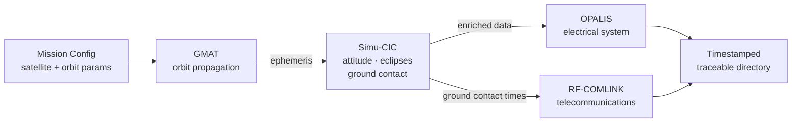

**Tip:** This is the most important diagram — make it large. Show parallel branches (OPALIS + RF-COMLINK) clearly.

---

## Slide 6b: Digital Thread & GMAT Templates

**Content (two columns):**

**Left — Satellite/Mission separation:**
- Satellite = reference data (immutable)
- Mission = study data (volatile)
- Each value carries provenance

**Right — GMAT template system:**
- Auto-extract modifiable values
- Anti-injection validation
- Catalog of validated scripts (80% coverage)
- LLM generation abandoned (unreliable, security risk)

**Visual — Digital thread provenance:**

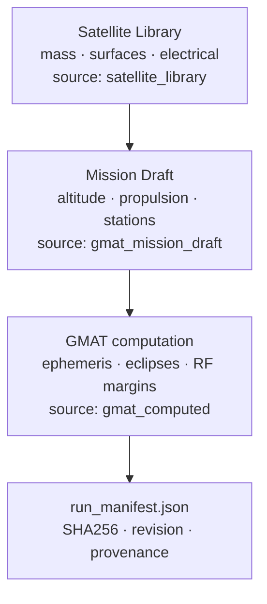

**Tip:** Use the provenance tags (`satellite_library`, `gmat_mission_draft`) as visible labels on arrows.

---

## Slide 6c: Results Page

**Content:**
- Runs list (filter by status/scenario)
- Single-run: metrics + time series + bar charts
- Multi-run (up to 5): overlay curves + unified comparison table
- AI assistant: disciplined prompt, evidence-based

**Visual — Results page mockup (wireframe-style):**

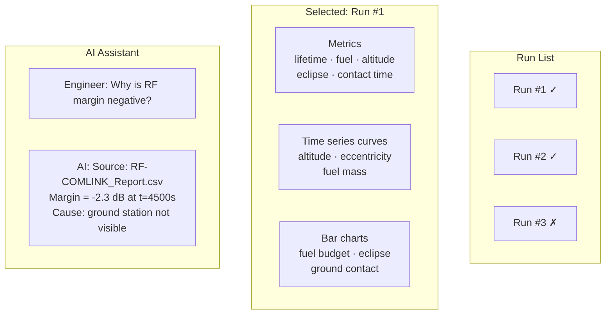

**Tip:** Use a screenshot of the actual Results page if available — more impactful than a wireframe.

---

## Slide 7: Validation & Limitations

**Content (two columns):**

**Left — Validation (green):**
- 96 backend + 17 frontend test files
- GMAT template hash validation
- `run_manifest.json` with SHA256 + provenance
- Validated cases: Hohmann, electric propulsion, orbit keeping

**Right — Limitations (orange/red):**
- Fixed satellite (no mass recompute)
- Limited GMAT scenarios (80% coverage)
- Read-only AI assistant (no execution)

**Visual — Validation coverage:**

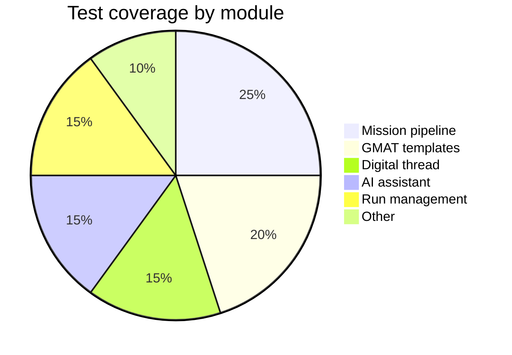

**Tip:** The pie chart is illustrative — adjust numbers if you have real counts.

---

## Slide 8: Assessment & Outcomes

**Content:**
- Technical: developer → architect
- Full-stack TypeScript (Fastify + React)
- 4 heterogeneous tools integrated
- AI that acknowledges its limits
- Key lesson: reliability > automation (pivot from AI orchestration)
- Human: China, foreign language, new field

**Visual — Skill progression:**

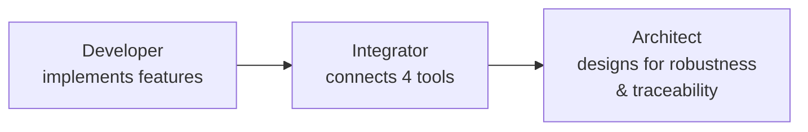

**Tip:** Keep this slide light on text — the speech carries the personal reflection.

---

## Slide 9: Conclusion & Perspectives

**Content:**
- Answer to problem: YES — IDM can be integrated via automated + traceable chain
- 4 objectives met
- Short-term: expose tool to AI agent (tool calling)
- Medium-term: augmented concurrent engineering room

**Visual — Future roadmap:**

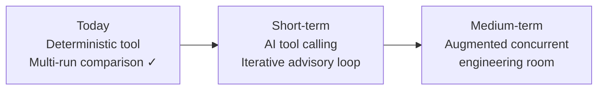

**Tip:** End with the key takeaway as a punchline on the slide:
> "Computational rigor and AI assistance can coexist, in the service of the engineer."

---

## Slide 10: Acknowledgments

**Content:**
- Dr. Farid Gamgami (supervisor)
- Laboratory team (welcome)
- Mrs. Costil, UTBM (academic tutor)
- Mr. He, Shanghai University (academic tutor)

**Visual:** Clean slide, names + affiliations, no diagram. Optional: group photo or lab photo as background.

---

## Summary: Slide Count

| # | Slide | Key visual |
|---|---|---|
| 1 | Title | Logos |
| 2 | Outline | Numbered list |
| 3 | Context | Org chart (mermaid) |
| 4 | Problem & Objectives | 2x2 grid (mermaid) |
| 5 | Methodology | Timeline (mermaid) |
| 6a | Demonstrator | Pipeline flow (mermaid) |
| 6b | Digital thread + templates | Provenance diagram (mermaid) |
| 6c | Results page | Wireframe or screenshot |
| 7 | Validation & Limitations | Pie chart + two columns |
| 8 | Assessment | Skill progression (mermaid) |
| 9 | Conclusion | Roadmap (mermaid) |
| 10 | Acknowledgments | Clean text |

**Total: 12 slides for 10 minutes ≈ 50s per slide average.**

---

## Appendix A: Satellite Subsystems Overview

> Reference diagram — can be used as a backup slide for Q&A, or as a small inset on Slide 4 (Problem) to illustrate *why* the interconnections matter.

**All satellite subsystems and their interconnections:**

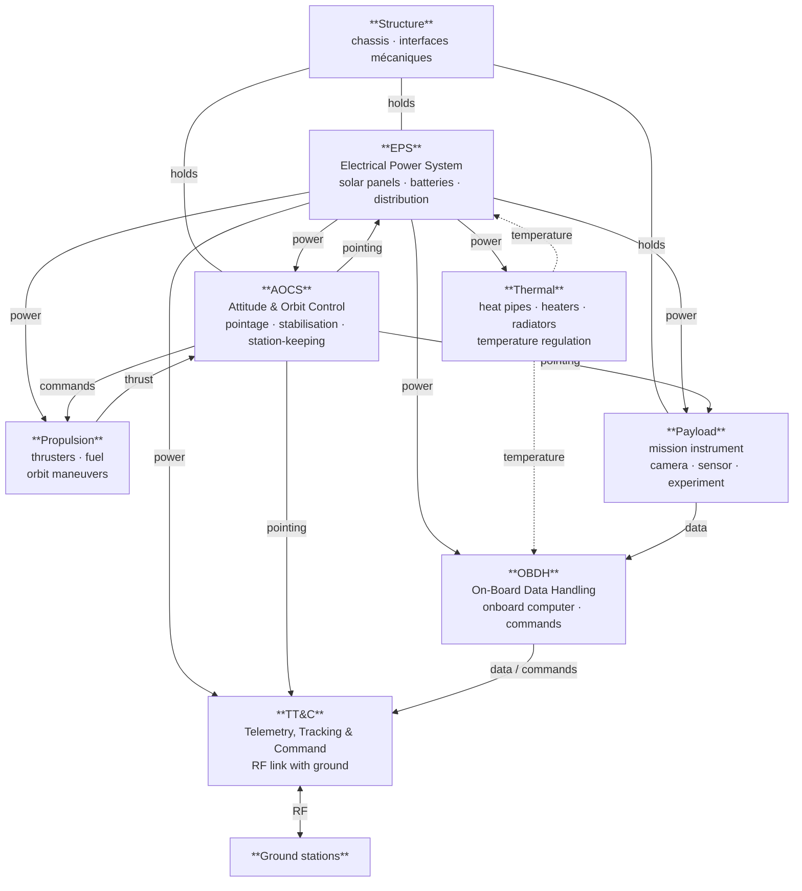

**Key coupling points (for the speech):**

| Coupling | Why it matters |
|---|---|
| EPS → all subsystems | Everything needs power; battery sizing depends on orbit eclipses |
| AOCS → EPS | Solar panel angle vs. Sun determines power generation |
| AOCS → TT&C / Payload | Antenna and instrument pointing |
| Propulsion ↔ AOCS | Thrusters execute attitude/orbit corrections; electric propulsion drains EPS |
| Orbit (GMAT) → eclipses → EPS | Trajectory defines eclipse duration → battery depth of discharge |
| OBDH ↔ TT&C | Telemetry down, commands up |

---

## Appendix B: Chain Reaction — Adding a Solar Panel

> Reference diagram — illustrates the cascade effect that the demonstrator makes visible. Best used during Q&A if the jury asks *« what happens when you change one parameter? »*.

**Scenario: the engineer adds one solar panel to increase power generation.**

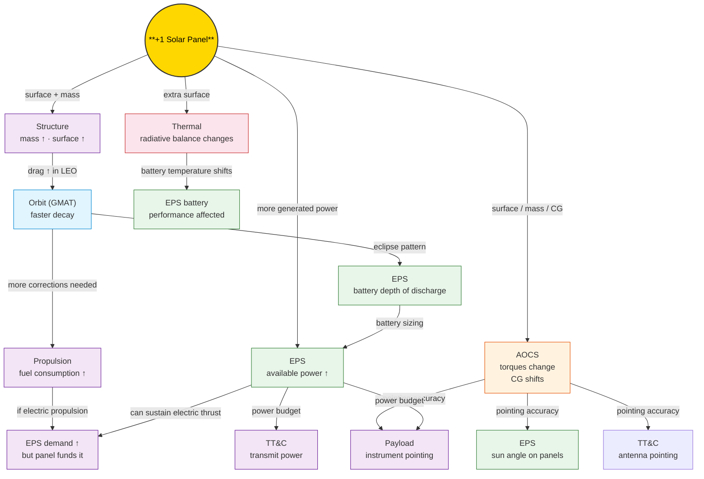

**The cascade in one line (for the speech):**

> *« Add one solar panel → the structure mass changes → the orbit decays faster → propulsion needs more fuel → if it's electric, the panel pays for itself → meanwhile the thermal balance shifts, the CG moves, the AOCS torques change, and the pointing of the antennas and payload is affected. One value, seven subsystems impacted. »*

**How the demonstrator reveals this:**

| Tool | What it computes in the cascade |
|---|---|
| GMAT | Orbit decay from increased drag (surface ↑) |
| Simu-CIC | Eclipse duration → battery depth of discharge; attitude torques from CG shift |
| OPALIS | Power budget: panel output vs. propulsion + payload demand |
| RF-COMLINK | Link budget: does the extra power help transmissions? Does the new attitude keep antennas pointed? |
